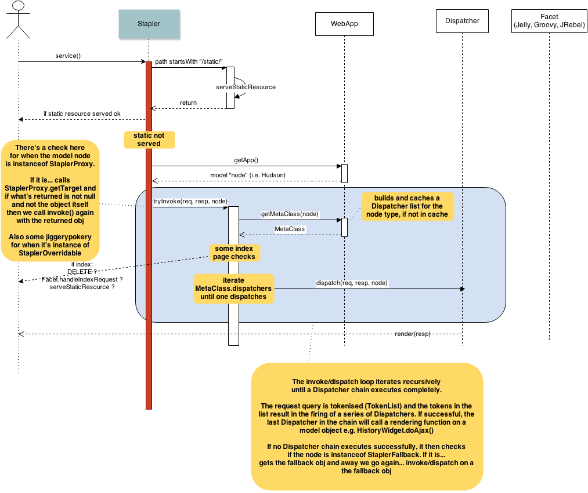

##Stapler

Jenkins startup creates an instance of `hudson.model.Hudson` (in `WebAppMain`, which is a `ServletContextListener`).  It attaches the `Hudson` instance to the `ServletContext`, from where `Stapler` can "get it".

[Stapler](http://stapler.kohsuke.org/) handles all requests into Jenkins.  The next section tries to make sense of that.

###Request Dispatch Mechanism

###WebApp
Lots of stuff in this class.  Among other things, it:

1.  Wraps the model (`Hudson`).
1.  Holds a "classMap", mapping object types to `MetaClass` instances
1.  Holds a `Facet` set - `GroovyFacet`, `JellyFacet`, `JRebelFacet`.

###MetaClass
Holds meta info about a model object type.  Holds a list of Dispatchers, which is build up (for a given type) by introspecting the object type in `MetaClass.buildDispatchers()`.

`MetaClass.buildDispatchers()` does the following:

1.  Methods that have a "do" name prefix add a `NameBasedDispatcher` impl. Can be optionally annotated with `@WebMethod` so as to change the name mapping to something other than the one normally derived from the method name.
1.  Methods that have a "js" name prefix add a `JavaScriptProxyMethodDispatcher`.
1.  Methods annotated with `@JavaScriptMethod` add a `JavaScriptProxyMethodDispatcher`.  The annotation can override the mapping name.
1.  If there's a method named "doIndex", a vanilla `Dispatcher` impl is added for that.
1.  A `NameBasedDispatcher` impl is added for every field/property on the type.
1.  A `NameBasedDispatcher` impl is added for every getter method on the type.  Again, `@WebMethod` can be optionally used to override the name mapping.
1.  Methods that have a single arg (arg types `StaplerRequest` or `String` or `int`) method add a `NameBasedDispatcher` impl.
1.  Array, `List` or `Map` types add a `Dispatcher` impls.
1.  If there's a method named "doDynamic", a vanilla `Dispatcher` impl is added for that.
1.  If there's a method with a name prefix of "getDynamic" and a single `String` arg, a vanilla `Dispatcher` impl is added for that.

__Note__: Between steps #3 and #4 (above), view dispatchers are added to the `WebApp`'s `Facet` set, using the `MetaClass` instance and the list of dispatchers gathered in the previous 3 steps.  From what I can see however, none of the Facet impls that I encountered (`GroovyFacet`, `JellyFacet`, `JRebelFacet`) seem to use the dispatcher list for anything.

__Note__: The `NameBasedDispatcher` impls all do different funky things.  See `MetaClass.buildDispatchers()`.

__Note__: `MetaClass` holds `MetaClass` instances `super`, so you can see the full graph.

__Note__: Between steps #8 and #9 (above), fallback dispatchers are added to the `WebApp`'s `Facet` set, using the `MetaClass` instance and the list of dispatchers gathered in the previous 8 steps.  The Facet impls that I encountered (`GroovyFacet`, `JellyFacet`, `JRebelFacet`) do nothing here i.e. don't seem to add anything.

###Serving static content
Stapler checks each request to see if it's a request for static content.  It perfmors expiry checks on it etc etc.  If it's not static content, it then proceeds to try serve it via invocation of dispatchers (matching tokens etc) via `WebApp`, `MetaClass` etc.

###StaplerProxy

###StaplerOverridable

###Facets (Groovy, Jelly etc) - View Dispatchers

###AdjunctManager
Manages static content such as Javascript, CSS etc.  Results in the &lt;script&gt; etc elements added to the response.

###Serving bound objects ('/$stapler/bound/...')
What's this about?
