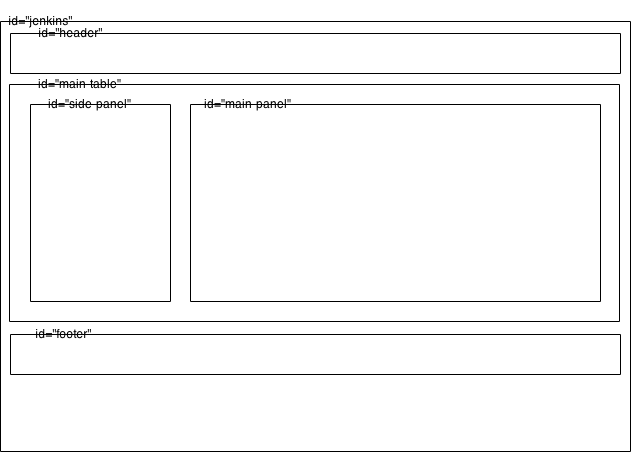

#Jenkins UI Structure

This doc contains notes about the Jenkins UI in terms of how it's structured visually and in the codebase out.

##Site Map/Layout

The "unmodified" Jenkins UI layout is as follows.

```
Dashboard - |
            | - Projects - |
                           | - Project 1
                           | - Project 2 -
                                         | - Configuration -
                                                           | - Basic Configs
                                                             + Advanced Options
                                                             + Source Code Management
                                                             + Build Triggers
                                                             + Build Steps
                                                             + Post Build Actions
                                         | - Workspaces
                                         | - Recent
                                         | - Perm Links
          | - People
          | - Build History
          | - Manage Jenkins
          | - Credentials
          | - UI Samples
```

Most of the detail is in the Project/Job configuration page, which is a flat structure. It looks to be fairly unstructured in terms of the order in which things are added to it.  Finding stuff on this page must be painful when the configuration gets complex (lots of plugins etc).

##Codebase Layout

Goto `core/src/main/resources/lib`.  There's a monkey load of Jelly templates in there.

##Page Layout

The main layout template is `core/src/main/resources/lib/layout/layout.jelly`.  It produces a general page layout as follows:



Most of the layout is done using &lt;table&gt; elements.

Jelly (somehow) applies this "layout", injecting content into the above panels.  For example, Jelly markup such as the following results in content being rendered in the "side-panel":

```
<l:side-panel>
  Side panel content ...
</l:side-panel>
```

It looks like the Jelly templating engine locates the layout template via a namespace decl of `xmlns:l="/lib/layout"` and then fills in based on element `id`.

__TODO__: Gather more info on how Jelly works.

##Component Contributions to UI (Plugins etc)
