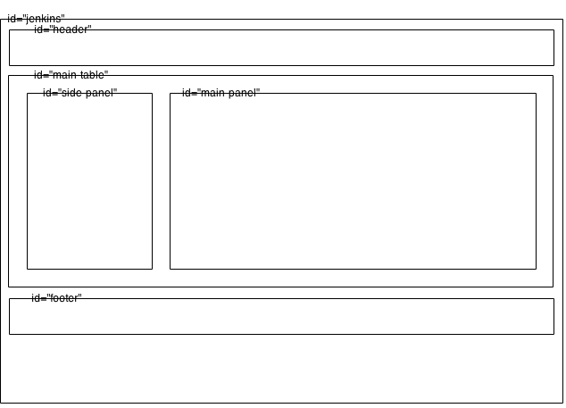

#Jenkins UI - Jelly, Groovy etc

This doc contains notes about the Jenkins UI in terms of how it's structured visually and in the codebase out.

##Site Map/Layout

The unmodified Jenkins UI layout (out of the "box") is as follows.

```
Dashboard - |
            | - Projects - |
                           | - Project 1
                           | - Project 2 -
                                         | - Configuration -
                                                           | - Basic Configs
                                                             + Advanced Options
                                                             + Source Code Management
                                                             + Build Triggers
                                                             + Build Steps
                                                             + Post Build Actions
                                         | - Workspaces
                                         | - Recent
                                         | - Perm Links
          | - People
          | - Build History
          | - Manage Jenkins
          | - Credentials
          | - UI Samples
```

Most of the detail is in the Project/Job configuration page, which is a flat structure. It looks to be fairly unstructured in terms of the order in which things are added to it.  Finding stuff on this page must be painful when the configuration gets complex (lots of plugins etc).

##Where are the templates?

Goto `core/src/main/resources/lib`.  There's a monkey load of Jelly templates in there.

##Main Template Layout

The main layout template is `core/src/main/resources/lib/layout/layout.jelly`.  It produces a general page layout as follows:



Most of the layout is done using &lt;table&gt; elements.

Jelly applies this "layout", injecting content into the above panels.  For example, Jelly markup such as the following results in content being rendered in the "side-panel":

``` xml
<l:side-panel>
  Side panel content ...
</l:side-panel>
```

It looks like the Jelly templating engine locates the layout template via a namespace decl of `xmlns:l="/lib/layout"` and then fills in based on element `id`.

##Example Page Rendering
The current server-side Stapler+Jelly+Groovy web framework is not the easiest to grok.  Let's take the main/home page and try make sense of its rendered, based on the standard Jenkins deployment/configuration built from GitHub.  Would be a good idea read a bit about [Stapler](jenkins-stapler.md).

When the main/home/dashboard page is requested, [Stapler](jenkins-stapler.md) receives a request for "". This is an "index" request, but Stapler does not find an index handler from any of the installed Facets (on the WebApp) for the root model node (`hudson.model.Hudson`).  Stapler also fails to find a Dispatcher to handle the request, but `Hudson` does have a fallback object instance of type `hudson.model.AllView`.  Stapler gets this object instance and
iterates the above process again using `AllView`.  This time it finds an index handler for `AllView`, which is the `hudson/model/View/index.jelly` Jelly script (located in `core/src/main/resources`).

```xml
<?jelly escape-by-default='true'?>
<st:compress xmlns:j="jelly:core" xmlns:st="jelly:stapler" xmlns:d="jelly:define" xmlns:l="/lib/layout" xmlns:t="/lib/hudson" xmlns:f="/lib/form" xmlns:i="jelly:fmt">
    <l:layout title="${it.class.name=='hudson.model.AllView' ? '%Dashboard' : it.viewName}${not empty it.ownerItemGroup.fullDisplayName?' ['+it.ownerItemGroup.fullDisplayName+']':''}" norefresh="${!it.automaticRefreshEnabled}">
      <j:set var="view" value="${it}"/> <!-- expose view to the scripts we include from owner -->
        <st:include page="sidepanel.jelly" />
        <l:main-panel>
          <st:include page="view-index-top.jelly" it="${it.owner}" optional="true">
            <!-- allow the owner to take over the top section, but we also need the default to be backward compatible -->
            <div id="view-message">
                <div id="systemmessage">
                  <j:out value="${app.systemMessage!=null ? app.markupFormatter.translate(app.systemMessage) : ''}" />
                </div>
              <t:editableDescription permission="${it.CONFIGURE}"/>
            </div>
          </st:include>

          <j:set var="items" value="${it.items}"/>
          <st:include page="main.jelly" />
        </l:main-panel>
        <l:header>
            <!-- for screen resolution detection -->
            <l:yui module="cookie" />
            <script>
              YAHOO.util.Cookie.set("screenResolution", screen.width+"x"+screen.height);
            </script>
        </l:header>
    </l:layout>
</st:compress>
```

For the most part, you can read this template and make sense of it.  It `<st:include>`s other templates etc.  It uses and expression language syntax, referencing `${it}` in a number of places.  `it` is the template context object and in this case that would be the `AllView` object instance.

One of the more interesting parts of this template is:

```xml
          <j:set var="items" value="${it.items}"/>
          <st:include page="main.jelly" />
```

`main.jelly` is actually the groovy script `hudson/model/View/main.groovy`.  Obvious eh ? :)

```java
package hudson.model.View;

t=namespace(lib.JenkinsTagLib)
st=namespace("jelly:stapler")

if (items.isEmpty()) {
    if (app.items.size() != 0) {
        set("views",my.owner.views);
        set("currentView",my);
        include(my.owner.viewsTabBar, "viewTabs");
    }
    include(my,"noJob.jelly");
} else {
    t.projectView(jobs: items, showViewTabs: true, columnExtensions: my.columns, indenter: my.indenter, itemGroup: my.owner.itemGroup) {
        set("views",my.owner.views);
        set("currentView",my);
        if (my.owner.class == hudson.model.MyViewsProperty.class) {
            include(my.owner?.myViewsTabBar, "myViewTabs");
        } else {
            include(my.owner.viewsTabBar,"viewTabs");
        }
    }
}
```

I'm not quite sure how you're supposed to follow things from this point, but I think I can make sense of the above script as follows:

1. If there are `items`, we render `t.projectView`.
1. Namespace `t` is `lib.JenkinsTagLib`.
1. You can find `lib.JenkinsTagLib` in `core/target/generated-sources/taglib-interface/lib/JenkinsTagLib.java`.  Apparently this is generated by the `org.jenkins-ci.tools:maven-hpi-plugin` build plugin, but not sure what the source is.
1. You can see that `JenkinsTagLib` is annotated with `@TagLibraryUri("/lib/hudson")`.
1. You'll find a `lib/hudson/projectView.jelly` in `core/src/main/resources`.

All this results in the tab bar being rendered.

As far as I can see, the only way to really figure any of this stuff out is to hook up a debugger, line up some strong coffee and patiently step through the code.
